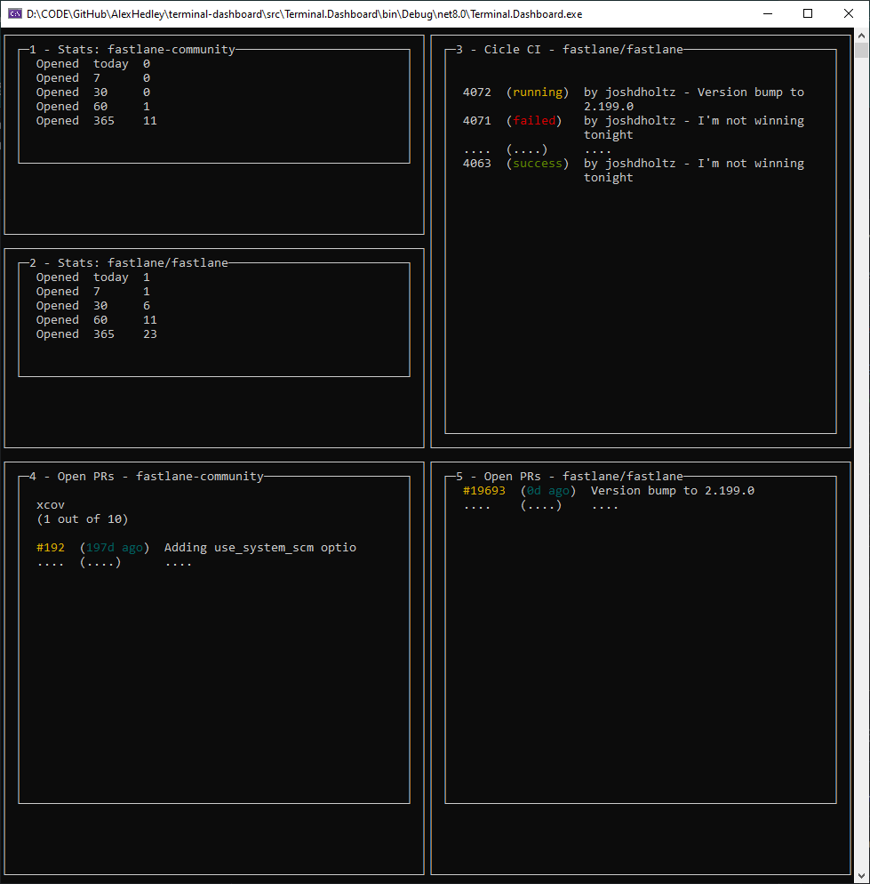

# terminal-dashboard

> **terminal dashboard** is a scriptable terminal dashboard.

 <!-- https://opensource.org/licenses/MIT -->

<!--  -->

<!--  -->
<!--  -->

<!-- ## Site

- https://alexhedley.github.io/terminal-dashboard -->

## WIP

## docs

- [docs](docs/README.md)

## src

- [src](src/README.md)

## Inspiration

> Wassup is a scriptable terminal dashboard. Configure panes and content logic in a Supfile and then run wassup.

- [wassup](https://github.com/joshdholtz/wassup) from [@joshdholtz](https://github.com/joshdholtz)
